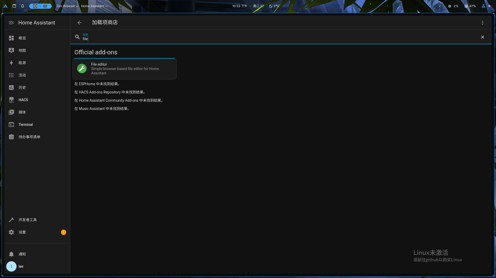
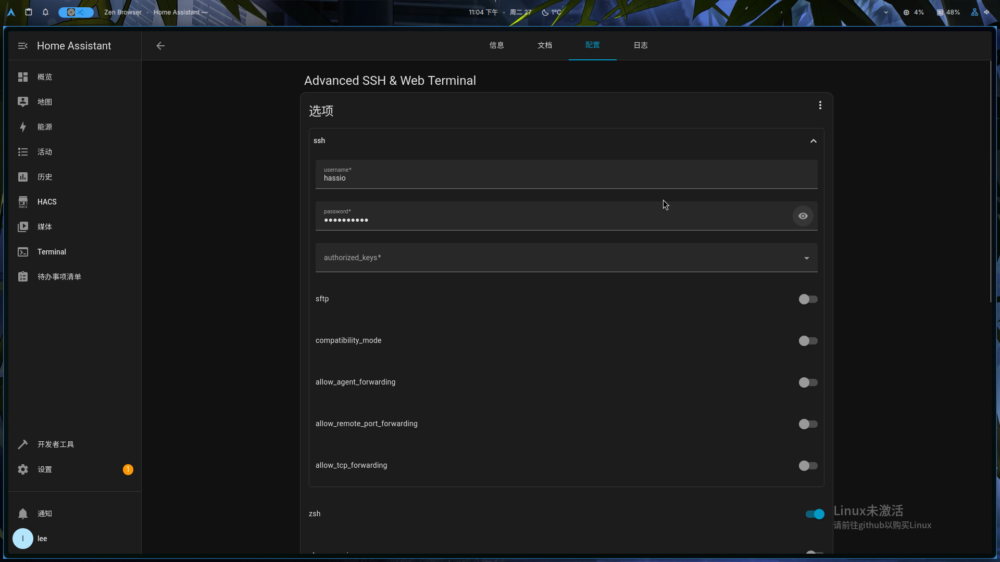
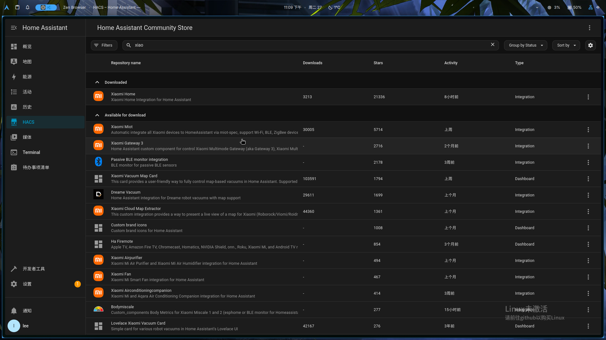
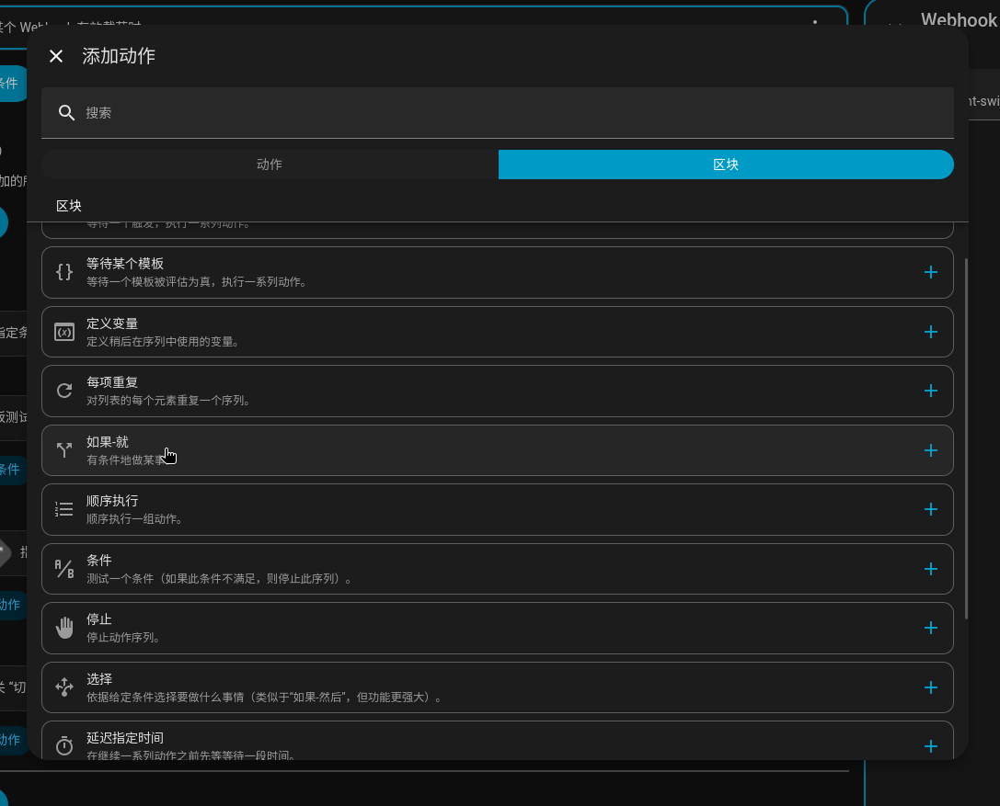

## 物品清单

我主要是用来给自己的卧式里灯加个智能开关试试水。
经pxx和某宝多方对比，市场上流通的智能开关都是蓝牙Mesh2.0接入米家的。我自己是没搞明白怎么自己搭建蓝牙Mesh2.0网关，只能自己花钱买了。
最便宜的是二手小爱音响...我实属难以接受家里有个奇奇怪怪的ai语音识别音箱，就买了个`Yeelight`蓝牙网关，加个140左右。

智能开关买的是不知名小作坊做的，价格40左右一个，不便宜。

::: tip
买之前先看下你家的灯是不是串联在零线上的。如果是的话，需要购买不要零线的版本，否则会无法使用。要零线的版本是和灯串联在一起的，会导致开关和灯的电压均不足无法正常工作。
~~我先图便宜买了个要零线的版本，回家接上去发现不好用才想起来家里零线上还串联了一个灯...~~
:::

## HomeAssistant安装

先按照[官网](https://www.home-assistant.io/installation/)说的装下。我装的是`HA OS`，直接扔到PVE的虚拟机里就完事了。注意需要开启`UEFI`引导，同时第一次启动时需要科学上网。

### 配置nginx

ha默认是不接受反代的，需要自己修改配置文件把反代地址加入到可信名单里。要修改ha的配置文件首先需要安装`File editor`。点击左下角的`设置`→`加载项`→`加载项商店`，搜索就可以找到安装。



安装后，打开它就能看到`config`文件夹，找到`configuration.yaml`文件，添加以下内容

``` yml
http:
  use_x_forwarded_for: true
  trusted_proxies:
    - 192.168.1.x  # 你的反代服务器地址
```

添加完记得保存，之后是这样的：


### 安装Web终端

和[安装`File editor`](#配置nginx)类似，去加载项安装`Advanced SSH & Web Terminal`。但要注意的是需要先去`配置`里编写一个用户和密码才可以使用。



## 连接智能设备

首先给你的智能设备接入米家，这里不再赘述。接入后再通过一些插件可以接入HomeAssistant来进行控制。

### 小米插件

小米官方是对HomeAssistant提供了官方插件，但是需要在`HACS`上安装。你可以去[HACS的官网](https://hacs.xyz/docs/use/)看如何安装，写的是比较详细的。
装完后去HACS栏安装`Xiaomi Home`插件就行了。



安装完后按照它说的授权就行了。要是授权完跳转到`homeassistant.local`之类的域名问题不大，给前面的域名改成你自己的域名就行了。
接着跟着它的指导，它会自动把所有设备都接入到HomeAssistant里。

## 控制智能设备

你可以在`设置`→`自动化与场景`里来创建控制逻辑。HomeAssistant支持通过Python来控制流程逻辑，功能非常强大。这里以我的WebHook控制智能开关为例。

HomeAssistant的开关有三种操作：`打开`，`关闭`，`切换开关`。
我的预期的行为逻辑是向HomeAssistant发送一个WebHook请求，如果包含一个`action`的参数，则按照指定操作执行，如果参数非法发通知，否则就`切换开关`。


### 创建Token

想要WebHook能被外部程序控制，需要创建一个长期token才可以。点击左下角的`用户头像`，`安全`分栏，在最下面的`长期令牌`里创建一个新的token，记得保存好。
你可以通过下面代码测试你的token是否有效。笔者收到的响应是`404: Not Found`。只要不是`401: Unauthorized`就说明token是有效的。

```python
token = '你自己创建的token'
import requests

url = "https://你的域名/api/error/all"
headers = {
    "Authorization": f"Bearer {token}",
}
response = requests.request("GET", url, headers=headers)

print(response.text)
```

### 创建自动化

#### 创建WebHook触发器

创建一个新的自动化，触发器选择`WebHook`，触发器ID可以自定义，我用的是`bedroom-light-switch`。
之后可以通过`https://你的域名/api/webhook/bedroom-light-switch`来触发这个自动化。

之后可以通过下面代码来测试触发器是否正常工作

```python
token = '你自己创建的token'
import requests

url = "https://你的域名/api/webhook/bedroom-light-switch"
headers = {
    "Authorization": f"Bearer {token}",
}
data = {
    'action': 'asd'
}
response = requests.post(url, headers=headers, json=data)
```

之后你会在自动化的执行记录里看到刚刚的触发记录。从中可以看到，我们传入的参数在`trigger.json`里。

``` yaml
variables:
  trigger:
    platform: webhook
    webhook_id: bedroom-light-switch
    json:
      action: asd
    query:
      __type: <class 'multidict._multidict.MultiDictProxy'>
      repr: <MultiDictProxy()>
    description: webhook
    id: "0"
    idx: "0"
    alias: null
context: null
```

#### 添加条件判断

`且如果`是从全局判断该自动化能否执行，我们用不上。在`就执行`里添加一个`如果-就`分支。它是在区块分栏里。~~近视眼笔者硬是手写yml都写完了，才发现有这个东西...~~



条件选择`模板`，内容如下：

```jinja
{{ trigger.get('json') != None }}
```

HomeAssistant的模板语法是基于Jinja2的，`{{}}`里面可以跑python参数，`trigger`是一个字典，直接get取值判断是否存在`json`参数。
`切换开关`在`动作`→`开关`里有，这里不细讲了。

下一个判断也是如法炮制，`模板`内容如下：

```jinja
{{ trigger.json.get('action') in ['turn_on', 'turn_off', 'toggle'] }}
```

具体为啥是`turn_on`，`turn_off`，`toggle`这三个参数，是因为HomeAssistant的开关动作就是这三个，笔者理解是枚举。

#### 执行自定义命令

我们要根据传进来的`action`参数来决定具体执行什么指令。这时候图形化就不好用了，我们都不知道要执行什么指令，怎么做图形化里选择？
对整个流程选择`YAML编辑`，就可以自己自定义了。


在最下面的if，我们可以发现之前添加到切换开关指令是长这个样子的

``` yaml
      - action: switch.toggle
        metadata: {}
        target:
          entity_id: 你的设备编号
        data: {}
```

我们如法炮制把它复制到第二个if的里，但把switch.toggle改成`switch.{{ trigger.json.action }}`。这样它就可以根据传进来的参数来决定执行什么操作了。

```yaml
          - action: switch.{{ trigger.json.action }}
            metadata: {}
            target:
              entity_id: 你的设备编号
            data: {}
```

#### 发送通知

发送通知选项有很多，大部分都是发送给设备，类似事件一样的东西。笔者也是翻了一会才找到发给用户看的通知。


这个也支持jinja模板渲染。这个没啥含金量，不细说了。

#### 调试

遇到问题可以点右上角`追踪`，它能输出很详细的过程。

## 结语

HomeAssistant是笔者接触到的第一个智能家居平台。模板渲染可以调用Python让它有了一定的可玩性，WebHook的支持也让它扩展性很强。
但它的模板语法写起来真的很繁琐，效率低下，要是可以直接跑Python就好了。
同时目前如何让这个家伙科学上网我也没研究明白，之前都是要装东西时让软路由开下系统代理。

---

amazing，我竟然写了篇200行的文章...这是我写的第一篇长文章吧，不知不觉中写了2h，希望对大家有帮助～
